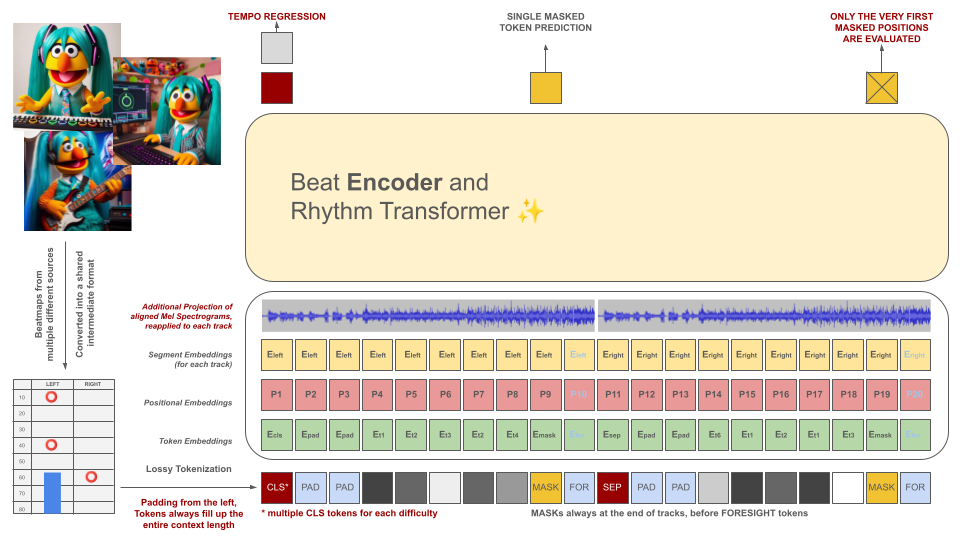

# Beat Learning
This Open Source research project aims to democratize the process of automatic beatmap creation, offering accessible tools and foundation models for game developers, players and enthusiasts alike, paving the way for a new era of creativity and innovation in rhythm gaming.

First models and example beatmaps are **coming really soon** (You Gotta Believe)!

## How to Contribute & Roadmap
This repository is still a **WORK IN PROGRESS**. The goal is to develop generative models capable of automatically producing beatmaps for a diverse array of rhythm games, regardless of the song. This research is still ongoing, but the aim is to get MVPs out as fast as possible.

All contributions are valued, especially in the form of compute donations for training foundation models. So, if you're interested, feel free to pitch in! 

- Add step-by-step examples on how to run and fine-tune models
- Simplify beatmap generation through Notebooks / Collab / Spaces / Gradio Apps etc.
- Improve the current work-in-progress OSU beatmap generator (only OSU maps and simple HIT objects are supported, without any sliders at the moment) + support Taiko and Mania maps
- Support additional rhythm games (currently the model is limited to rhythm games with 1, 2 or 4 tracks, so Guitar Hero-like games with 5 tracks will have to wait)
- Better integration to HuggingFace (extend the model class to smoother loading / saving)
- Add autoamtic tests and github hooks, make the code production ready + add more detailed documentation
- Publish a paper on BEaRT

Join us in exploring the endless possibilities of AI-driven beatmap generation and shaping the future of rhythm games!

## BEaRT


Rhythm game beatmaps are initially converted to an intermediate file format, which is then tokenized into 100ms chunks. Each token is capable of encoding up to two different events within this time period. The vocabulary is precalculated rather than learned from the data to meet this criterion. The context length and vocabulary size are intentionally kept small due to the scarcity of quality training examples in the field.
These tokens, along with slices of the (projected Mel Spectogram of the) audio data, serve as inputs for a masked encoder model. Similar to BeRT, the encoder model has two objectives during training: estimating the tempo through a regression task and predicting the masked (next) token(s).
Beatmaps with 1, 2, and 4 tracks are supported. Each token is predicted from left to right, following the generation process of a decoder architecture. However, the masked tokens have access to additional audio information from the future.

## Legal
The AI model's purpose is not to devalue individually crafted beatmaps, but rather:

1. To assist map creators in efficiently producing new beatmaps.
2. To aid smaller developers in effortlessly creating content for their rhythm games.
3. To enhance exposure for indie music artists by incorporating their work into video games.

All generated content **must comply with EU regulations** and be appropriately labeled, including metadata indicating the involvement of the AI model.

GENERATION OF BEATMAPS FOR COPYRIGHTED MATERIAL IS STRICTLY PROHIBITED! ONLY USE SONGS FOR WHICH YOU POSSESS RIGHTS!

To prevent your beatmap from being utilized as training data in the future, include the following metadata in your beatmap file:
```
robots: disallow
```

## Special Thanks
The project draws inspiration from a previous attempt known as [AIOSU](https://www.nicksypteras.com/blog/aisu.html).  
Besides relying on the OSU's wiki, [osu-parser](https://github.com/nojhamster/osu-parser) has been instrumental in clarifying beatmap declarations (especially sliders). The transformer model was influenced by [NanoGPT](https://github.com/karpathy/nanoGPT) and from the pytorch implementation of [BeRT](https://github.com/codertimo/BERT-pytorch/).